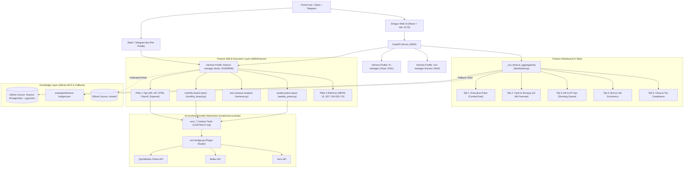

# Architecture — Shogun OS

## Overview
Shogun OS is an open reference architecture and provisioning toolkit for deploying multi-department AI agent operations. It deploys 10 independent Hermes Agent profiles (such as `finance-manager`, `hr-manager`, and `coding-agent`), each connected to its own isolated GBrain knowledge source and dedicated Slack/Telegram bot. The system provides an end-to-end multi-tenant Web Portal with an executive 5-tab Finance Dashboard, domain provider abstractions (such as the `acct_*` accounting contract), and a 4-pillar department skill ecosystem.

## System Diagram

## Component Breakdown

### 1. Web Portal & Executive Finance Dashboard (`shogun-web/`)
Provides a centralized multi-tenant web application for managing all 10 departments:
- **Backend Aggregator (`shogun-web/server/dashboard.py`):** Exposes `GET /api/departments/finance/dashboard/finance-stats`, querying live GBrain finance snapshot pages with automatic fallback to `examples/finance-budget.json`.
- **React UI (`shogun-web/ui/src/components/dashboards/finance/`):** Renders the 5-tab Finance Dashboard (`ExecutivePulseTab`, `CashRunwayTab`, `WorkingCapitalOpsTab`, `BvaUnitEconomicsTab`, `CloseTaxComplianceTab`) with `ComboChart.tsx` (Recharts `ComposedChart`) and interactive dunning/claim modals.

### 2. Profiles Layer (Hermes Agent)
Contains 10 independent department profiles (`~/.hermes/profiles/<name>`). Each profile has physical, knowledge, and communication isolation with its own `config.yaml`, `SOUL.md`, `.env`, gateway port, and linked `skills/`.

### 3. Knowledge Layer (GBrain MCP)
Hybrid search engine powered by PostgreSQL 16 + `pgvector` and local Ollama embeddings (768d). Segmented into isolated sources (`finance/`, `hr/`, `crm/`, `engineering/`) with federated read-only access to `shared/`.

### 4. Provider Abstraction Layer (`recipes/accounting/`)
Decouples agent logic from vendor APIs through standard tool contracts (`acct_*`). Implements dynamic plugin loading (`acct-bridge.py`) for accounting software backends (QuickBooks Online, Bukku, Xero).

### 5. Finance Skill & Report Generator Layer (`skills/finance/`)
Houses 22 production skills across 4 corporate finance pillars:
- **Pillar 1 (Operations):** `ar-credit-control`, `ap-vendor-management`, `malaysia-contractor-cp58-wht`, `payroll-statutory-accounting`, `expense-claim-audit`.
- **Pillar 2 (Accounting & Close):** `general-ledger-journal-prep`, `bank-payment-reconciliation`, `period-end-close-checklist`, `financial-statement-prep`.
- **Pillar 3 (FP&A):** `budget-financial-modeling`, `bva-variance-analysis`, `cash-runway-forecasting`, `unit-economics-margin-analysis`, `revenue-concentration-audit`, `cfo-executive-reporting`.
- **Pillar 4 (Treasury/Tax/Governance):** `mfrs15-revenue-recognition`, `tax-sst-compliance`, `internal-control-governance`, `isa530-audit-pbc-support`, `treasury-fx-facility-mgmt`.
- **Report Generators:** `weekly-pulse-report` (`weekly_pulse.py`), `monthly-board-report` (`monthly_board.py`).

### 6. Execution & Automation Layer (`scripts/`)
Provisioning and automation scripts:
- `generate-profile.py` — Profile generator with skill mapping, `scrum.yaml` copying, and `budget.json` baseline seeding.
- `wire-crons.py` — Profile-scoped cron wirer for 3-tier scrum and department domain crons.
- `variance.py` — Pure stdlib Budget vs. Actual (BvA) variance computation script.

---

## Data Flow

### Primary Flow: Weekly Financial Pulse Report Generation
1. **User / Cron Trigger:** User requests `/weekly-pulse-report` or cron fires `finance-manager-weekly-budget` at `0 8 * * 1`.
2. **Data Gathering (4 Steps):**
   - Step 1: Koku calls `acct_get_balance_sheet(as_of_date=today)` to fetch bank balance.
   - Step 2: Koku calls `acct_get_aging_report(type="receivable")` to audit 0-30/31-60/61-90/90+ day buckets.
   - Step 3: Koku calls `acct_get_aging_report(type="payable")` and `acct_list_purchase_bills()` to get upcoming commitments.
   - Step 4: Koku calls `acct_get_profit_loss(date_from=month_start, date_to=today)` to evaluate MTD revenue and spend pacing.
3. **Computation & Formatting:** `weekly_pulse.py` computes runway months, monthly burn rate, and formats the executive markdown output.
4. **Archive & Delivery:** Report is delivered to the Slack/Telegram channel and archived to `finance/reports/weekly/YYYY-MM-DD.md` in GBrain.

### Primary Flow: Monthly Board Report & BvA Analysis
1. **Trigger:** User requests `/monthly-board-report` or cron fires `finance-manager-monthly-pnl` on the 1st of the month.
2. **P&L & BS Gathering:** Koku executes `acct_get_profit_loss` for current and prior month, plus `acct_get_balance_sheet`.
3. **Subprocess BvA Call:** `monthly_board.py` invokes `variance.py` passing `--budget finance/budget.json` and `--actuals <P&L JSON>`.
4. **Variance Computation:** `variance.py` matches actual spend against budget baselines per `account_code`, computes variance percentages, and flags lines with `>10% Overrun` (`⚠️`). If `budget.json` is missing, it degrades gracefully with a warning message.
5. **Concentration Risk Audit:** Koku executes `acct_list_sales_invoices` to compute single-client revenue concentration (flags >20%).
6. **Archive & Delivery:** Final board report rendered and archived to GBrain `finance/reports/monthly/`.

---

## Key Design Decisions

1. **Physical & Knowledge Isolation:** Profiles share no configuration or memory. Each department writes only to its own GBrain source (`finance/`), protecting sensitive financial data from other department bots.
2. **Provider Abstraction Pattern:** Agent logic depends strictly on the generic `acct_*` tool signatures (`CONTRACT.md`), ensuring that switching from QuickBooks to Bukku or Xero requires zero changes to skills or prompts.
3. **Pure Stdlib Computation:** Report and variance engines (`variance.py`, `weekly_pulse.py`, `monthly_board.py`) use pure Python standard library to ensure deterministic execution, fast cold starts, and easy testing via `--dry-run`.
4. **Graceful Degradation:** When optional assets (like `budget.json` or live API credentials) are absent, report scripts degrade gracefully rather than crashing.

---

## External Dependencies

| Dependency | Type | Purpose | Notes |
|---|---|---|---|
| PostgreSQL 16 + pgvector | Database | Vector search & page storage for GBrain | Containerized or local system service |
| Ollama | Embedding Model | Local 768d embeddings (`nomic-embed-text`) | Zero API cost |
| QuickBooks Online / Bukku / Xero | External Accounting API | Live ledger data for `acct_*` contract | Connected via `recipes/accounting/` bridge |
| Slack / Telegram | Messaging Platform | DMs, channel updates, scheduled crons | Per-profile bot tokens in `.env` |
| Python 3.10+ | Runtime | Script execution & Hermes Agent engine | Stdlib + PyYAML + requests |
