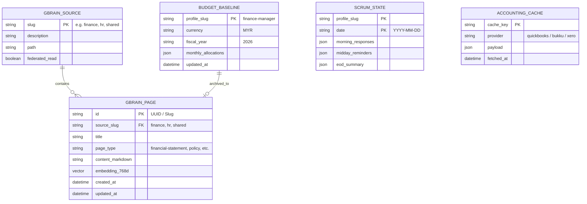

# Database Schema — Shogun OS

## Storage Technology

Shogun OS utilizes a hybrid storage architecture:

1. **PostgreSQL 16 + pgvector (GBrain Knowledge Store):** Stores department brain pages, hybrid search indexes, and 768-dimensional vector embeddings generated by Ollama (`nomic-embed-text`).
2. **SQLite / Local Storage (`~/.hermes/profiles/<profile>/`):** Stores per-profile state, session logs, and scrum execution states (`scrum.yaml`).
3. **JSON File Schemas (`budget.json`):** Stores departmental baseline budget allocations for Budget vs. Actual (BvA) variance analysis.

---

## Entity Relationship Diagram



---

## Dashboard Registry & GBrain Finance Snapshot Schemas

### `dashboard_meta` Configuration (`shogun-web/server/dashboard.py`)
| Department | Enabled | Tabs Configured | Aggregation Function |
|---|---|---|---|
| `crm` | `True` | Revenue, Pipeline, Partner, Managers, Deals | `_run_ceo_aggregation()` |
| `finance` | `True` | Executive Pulse, Cash & Runway, AR & AP Ops, Budget vs Actuals, Close & Tax | `_run_finance_aggregation()` |

### GBrain Finance Snapshot Slugs (`finance/` Source)
- `snapshots/cash` — Contains `total_liquid_cash`, `net_monthly_burn`, `cash_runway_months`, `bank_accounts`, `fx_positions`, `forecast_13w`.
- `snapshots/pl` — Contains `revenue_mtd`, `revenue_ytd`, `gross_margin_pct`, `ebitda_margin_pct`, `revenue_opex_trend`.
- `snapshots/ar` — Contains `total_ar`, `ar_overdue_30`, `dso`, `bucket_0_30`, `bucket_31_60`, `bucket_61_90`, `bucket_90_plus`, `dunning_queue`.
- `snapshots/ap` — Contains `total_ap`, `ap_overdue`, `dpo`, `bills`.
- `snapshots/bva` — Contains `departments`, `unit_economics`.
- `snapshots/concentration` — Contains `clients` revenue percentage breakdown.
- `snapshots/compliance` — Contains `close_checklist`, `statutory_schedule`, `sst_readiness`, `cp58_register`, `wht_queue`, `expense_claim_audit`.

---

## Table & Schema Definitions

### 1. GBrain Knowledge Database (`PostgreSQL`)

#### `gbrain_sources`
| Field | Type | Key | Description |
|---|---|---|---|
| `slug` | VARCHAR(64) | PK | Source identifier (`finance`, `hr`, `shared`, etc.) |
| `path` | VARCHAR(512) | | Local directory path (`~/brain/finance`) |
| `description` | TEXT | | Human-readable source scope |
| `created_at` | TIMESTAMP | | Source provisioning timestamp |

#### `gbrain_pages`
| Field | Type | Key | Description |
|---|---|---|---|
| `id` | VARCHAR(255) | PK | Page slug / relative filepath |
| `source_slug` | VARCHAR(64) | FK | References `gbrain_sources.slug` |
| `title` | VARCHAR(255) | | Page title extracted from H1 / YAML |
| `page_type` | VARCHAR(64) | | Page type (`financial-statement`, `board-report`, `policy`) |
| `content` | TEXT | | Markdown page body |
| `embedding` | VECTOR(768) | | `pgvector` embedding from Ollama |
| `updated_at` | TIMESTAMP | | Last modified timestamp |

---

### 2. Budget Baseline Schema (`finance/budget.json`)

File location: `~/.hermes/profiles/finance-manager/budget.json`

```json
{
  "fiscal_year": "2026",
  "currency": "MYR",
  "department": "Finance",
  "monthly_budget": {
    "COGS": 150000.00,
    "PAYROLL": 85000.00,
    "MARKETING": 30000.00,
    "OPEX": 25000.00,
    "SOFTWARE": 8000.00,
    "FACILITIES": 12000.00
  },
  "revenue_target_monthly": 400000.00,
  "max_allowed_variance_pct": 10.0
}
```

---

### 3. Scrum Execution State (`scrum.yaml`)

File location: `~/.hermes/profiles/finance-manager/scrum.yaml`

```yaml
department: Finance
profile: finance-manager
team_lead:
  name: Koku
  slack_id: U0XXXXXXX
team_members:
  - name: Account Executive
    slack_id: U0XXXXXXX
    role: AP/AR Specialist
channel: C0XXXXXXX
schedule:
  morning: "0 9 * * 1-5"
  midday: "0 11 * * 1-5"
  eod: "0 17 * * 1-5"
```

---

## Data Retention & Archival Policy

1. **GBrain Reports (`finance/reports/`):** Permanent storage in PostgreSQL. Indexed for hybrid search so past board reports and weekly pulses remain retrievable.
2. **Ephemeral Accounting Cache:** Accounting API responses (`acct_*`) are held in memory or temporary cache for the duration of a report run (max 15 min TTL).
3. **Scrum Logs:** Daily standup updates are summarized to the team channel and archived weekly to `finance/scrum/` in GBrain.
