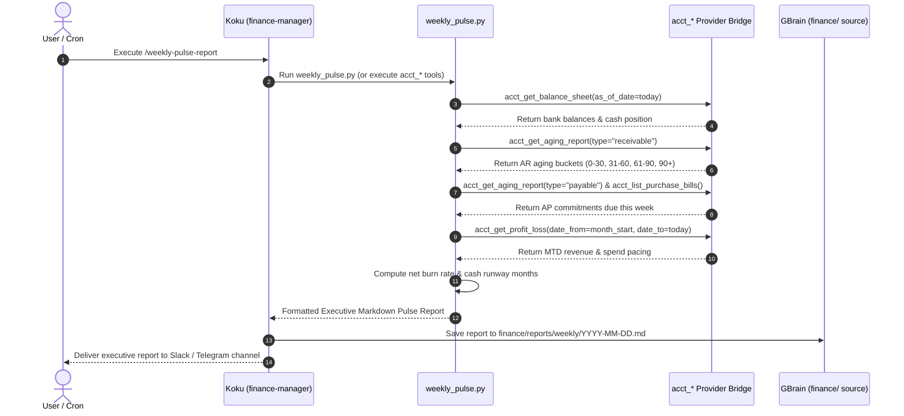
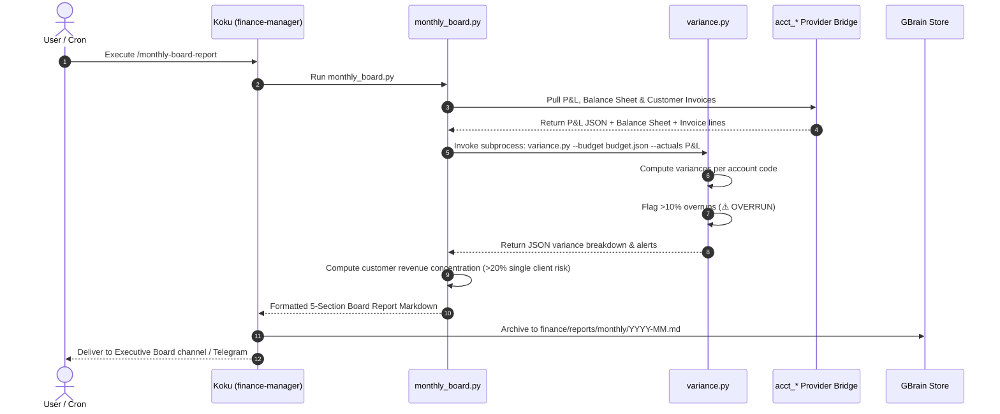
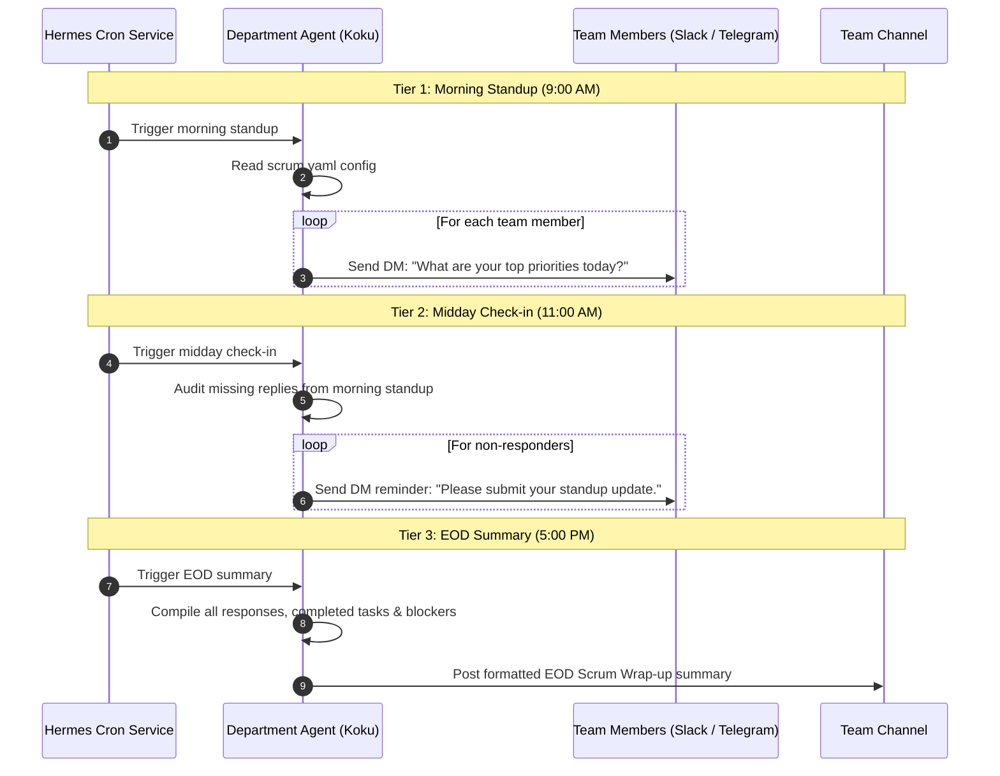
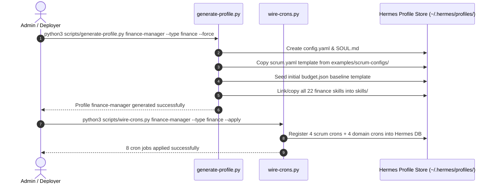
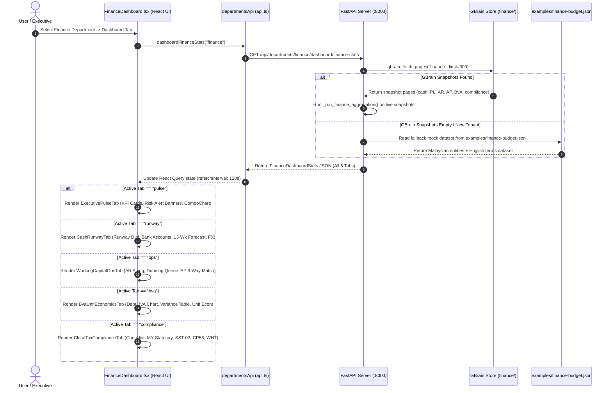

# Workflows — Shogun OS

This document details the core runtime flows of Shogun OS using Mermaid sequence diagrams.

---

## Workflow 1: Weekly Executive Financial Pulse Report

**Trigger:** Scheduled cron (`0 8 * * 1`) or manual command (`/weekly-pulse-report` / `hermes -p finance-manager -z "/weekly-pulse-report"`).  
**Actor:** Koku (`finance-manager` profile agent).

### Edge Cases & Failure Modes
- **Missing Provider Credentials:** If live `acct_*` tools are unavailable, `weekly_pulse.py` falls back to `--dry-run` sample data and notes the fallback state in the output header.
- **API Rate Limits / Outage:** The script catches HTTP connection errors gracefully and reports last cached figures with a staleness warning (`⚠️ Data as of cached timestamp`).

---

## Workflow 2: Monthly Board Report & BvA Variance Analysis

**Trigger:** Scheduled cron (`0 8 1 * *`) or manual command (`/monthly-board-report`).  
**Actor:** Koku (`finance-manager` profile agent).

### Edge Cases & Failure Modes
- **Missing `budget.json`:** If `budget.json` baseline does not exist in the profile folder, `variance.py` returns actual figures with a warning: `⚠️ Budget baseline (budget.json) missing. Showing actuals only.`
- **Unicode Console Encoding on Windows:** `monthly_board.py` explicitly forces `sys.stdout` UTF-8 wrapper and sets `PYTHONIOENCODING=utf-8` on subprocess execution to prevent `cp1252` character encoding failures on emojis.

---

## Workflow 3: 3-Tier Department Scrum Standup

**Trigger:** Cron jobs (Morning 9:00 AM, Midday 11:00 AM, EOD 5:00 PM weekdays).  
**Actor:** Department Manager Agent (e.g. `finance-manager` Koku).

---

## Workflow 4: Profile Provisioning & Cron Wiring

**Trigger:** CLI deployment command (`generate-profile.py` & `wire-crons.py`).  
**Actor:** System Administrator / Deployment Agent.

---

## Workflow 5: Executive & Operations Web Portal Finance Dashboard

**Trigger:** User clicks on the **Finance Department Dashboard** in the Shogun OS Web Portal (`http://localhost:5173`).  
**Actor:** Web Portal User / Executive / Finance Staff.

### Edge Cases & Failure Modes
- **GBrain Service Offline:** If the GBrain daemon or PostgreSQL connection fails, `_run_finance_aggregation()` catches the connection error and seamlessly falls back to reading `examples/finance-budget.json` so the UI remains fully functional.
- **New Tenant Zero-State:** For fresh tenants with no transaction history, `examples/finance-budget.json` provides populated Malaysian demo data for immediate executive evaluation.
